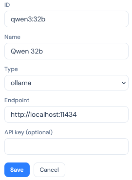
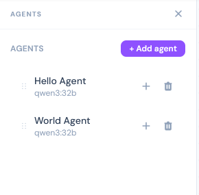
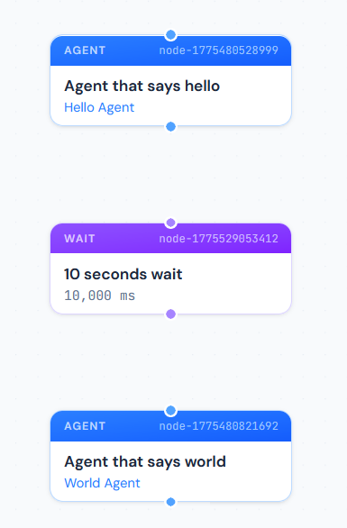
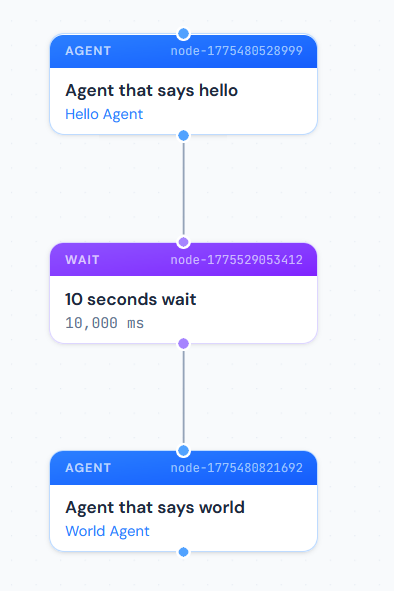
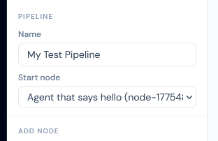
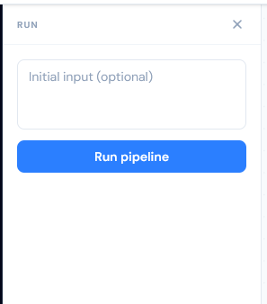
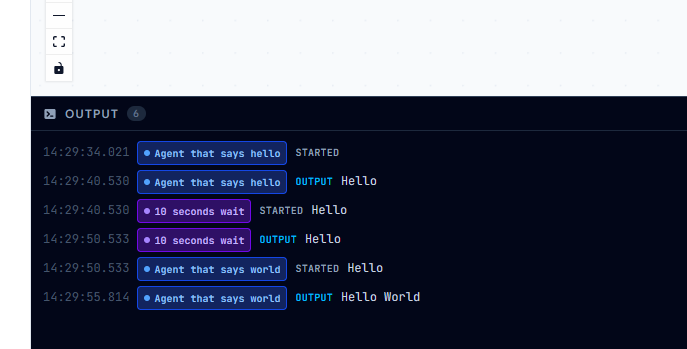

# Tutorial: Building a Hello World Pipeline

This tutorial walks through building a simple pipeline that produces the output **"Hello World"** using two agent nodes with a wait in between. By the end you will have used every major part of the editor: loading a directory, configuring a model, creating agents, placing and connecting nodes on the canvas, and watching a live run in the output console.

## What you will build

```
Agent that says hello → 10 seconds wait → Agent that says world
```

- **Agent that says hello** — calls the model, which replies with `Hello`.
- **10 seconds wait** — passes the text through after a 10-second delay.
- **Agent that says world** — receives `Hello`, concatenates ` World`. Outputs `Hello World`.

---

## Step 1 — Create the pipeline directory

vectrun reads everything from a local directory. Create a folder for your pipeline:

```
Documents/
└── AI Pipelines/
    └── Test 1/          ← your pipeline directory
        ├── pipeline.json
        ├── models.json
        ├── tools.json
        └── agents/
```

You can create the folder anywhere. vectrun will scaffold the required files when you load an empty directory for the first time.

---

## Step 2 — Load the directory in the editor

Start the backend and open the editor (see [Getting started](README.md#getting-started)).

On the welcome screen, type or paste the path to your pipeline directory and click **Load**. If the directory is empty vectrun will offer to scaffold a blank workspace — accept it.

Once loaded, the pipeline name appears in the top-right corner of the window and the empty canvas is ready.

---

## Step 3 — Configure the model

Click the **Models** icon (database icon) in the left icon bar to open the Models panel.

Click **+ Add model** and fill in the form:

| Field    | Value |
|----------|-------|
| ID       | `qwen:32b` |
| Name     | `Qwen 32B (local)` |
| Type     | `ollama` |
| Endpoint | `http://localhost:11434` |
| API key  | *(leave blank)* |

> **ID** is the identifier sent to the Ollama server — it must match the model name you have pulled locally (`ollama pull qwen:32b`). **Name** is a display label used only in the UI.

Click **Save**. The model appears in the list.



---

## Step 4 — Create the agents

Click the **Agents** icon (person icon) in the left icon bar.

### Hello Agent

Click **+ Add agent** and fill in:

| Field         | Value |
|---------------|-------|
| Agent name    | `Hello Agent` |
| Model         | `Qwen 32B (local)` |
| Output        | `plain_text` |
| System prompt | `You are a AI assistant that always replies with saying Hello` |
| Prompt        | *(leave blank)* |

Leave Tools unchecked. Click **Save**.

### World Agent

Click **+ Add agent** again:

| Field         | Value |
|---------------|-------|
| Agent name    | `World Agent` |
| Model         | `Qwen 32B (local)` |
| Output        | `plain_text` |
| System prompt | `You are an AI assistant that takes the whatever value is in the prompt and concatenates " World" to it.` |
| Prompt        | *(leave blank)* |

When `prompt` is left blank, the agent receives the previous node's output directly as its user message. The World Agent will therefore receive `Hello` from the pipeline and append ` World` to it.

Click **Save**.



---

## Step 5 — Set the pipeline name

Click the **Nodes** icon (grid icon) in the left icon bar to open the Nodes panel.

Under **Pipeline**, set:

- **Name** → `My Test Pipeline`

Leave **Start node** alone for now — you will set it after adding the nodes.

---

## Step 6 — Add nodes to the canvas

Three nodes are needed. You can add them by dragging from the panel or by clicking the **+** button.

### Add the first agent node

In the **Agents** panel, find **Hello Agent** in the list. Either:
- Drag it from the list onto the canvas, or
- Click the **+** button next to it to place it at the canvas centre.

An **Agent** node appears on the canvas and is selected automatically. In the Nodes panel, open its properties and set:
- **Name** → `Agent that says hello`

The node card on the canvas updates immediately.

### Add the Wait node

Open the **Nodes** panel. Under **Add node**, click or drag **Wait** onto the canvas below the first node.

Click the new Wait node to open its properties and set:
- **Name** → `10 seconds wait`
- **Duration** → `10000` ms

### Add the second agent node

From the **Agents** panel, drag or click **+** on **World Agent** to add it below the Wait node.

Set:
- **Name** → `Agent that says world`



---

## Step 7 — Connect the nodes

Nodes are connected by dragging from an output handle (the dot at the bottom of a node) to an input handle (the dot at the top of the next node).

1. Drag from the bottom of **Agent that says hello** → top of **10 seconds wait**.
2. Drag from the bottom of **10 seconds wait** → top of **Agent that says world**.

The canvas should now show a vertical chain of three connected nodes:

```
┌────────────────────────────┐
│ AGENT    node-...          │
│ Agent that says hello      │
│ Hello Agent                │
└──────────────┬─────────────┘
               │
┌──────────────▼─────────────┐
│ WAIT     node-...          │
│ 10 seconds wait            │
│ 10,000 ms                  │
└──────────────┬─────────────┘
               │
┌──────────────▼─────────────┐
│ AGENT    node-...          │
│ Agent that says world      │
│ World Agent                │
└────────────────────────────┘
```



---

## Step 8 — Set the start node

In the **Nodes** panel, open the **Start node** dropdown. Select **Agent that says hello (node-...)**.

This tells the runtime which node to execute first.



---

## Step 9 — Save the workspace

Click the **Save** icon (floppy disk) at the bottom of the left icon bar. The icon briefly turns green to confirm the save. All JSON files in your pipeline directory are updated.

---

## Step 10 — Run the pipeline

Click the **Run** icon (play button) in the left icon bar to open the Run panel.

The input field is optional — leave it blank for this pipeline. Click **Run pipeline**.



The **Output** console at the bottom of the canvas expands automatically and streams log entries as each node executes:

```
● Agent that says hello   STARTED
● Agent that says hello   OUTPUT   Hello
● 10 seconds wait         STARTED  Hello
● 10 seconds wait         OUTPUT   Hello
● Agent that says world   STARTED  Hello
● Agent that says world   OUTPUT   Hello World
```

The final output of the pipeline is **Hello World**.



### Reading the output console

- Each row shows the **timestamp**, the **node** that produced the entry (colour-coded by type), the **event**, and the **message**.
- Use the **All nodes** dropdown in the console header to filter entries by a specific node.
- Click **Clear** to wipe the log between runs.
- The console collapses back to its header bar when you click the chevron — the log is preserved until you clear it or run again.

---

## What's next

- Add a **Branch** node after the last agent to route on the output content.
- Use a **Logic** node to call an external script and transform the text between agents.
- Define tools and attach them to agents to give them web search, file access, or any capability you can implement as a stdin/stdout executable.
- Loop the graph by connecting a node back to an earlier one — vectrun will keep cycling until a branch routes out of the loop.
